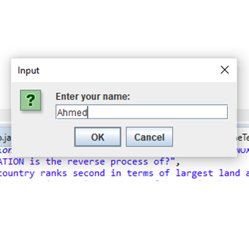
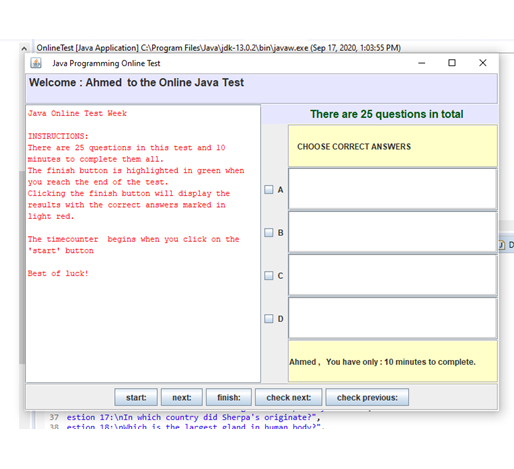
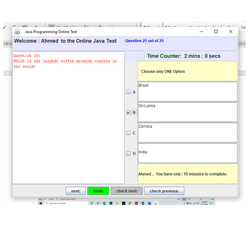
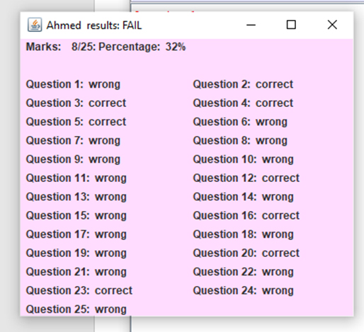

# QUIZ-USING-MULTITHREAD-
The main idea of this project is to build a quiz app implementing operating system concepts.\
This project gives the efficient and much easier way for giving online quiz or exams.\
This project can be used in online surveys, competitive exams and feedback questions for various applications.\
	This project ask name of user who is taking test , and navigates to welcome window.\
  As the user enters start button, the quiz will be started. User has to answer the question\
  before the time limit. Questions are multiple choice questions.\
  The options will be displayed. User can answer, or skip the question. After answering question user has to click\
  ‘next’ button, it will be move on to next question. At the end of the exam the result will be given. \
  As it gives instant result it will be efficient in the quick surveys.\
This project is coded in core java as it provides easy way for designing interface and\
multithreading The concept used in this project are java swing and multithreading.\
Multithreading is used to handle several users at a time. Java swing concepts are used for designing interface

## screenshots

.......................

......................

......................

